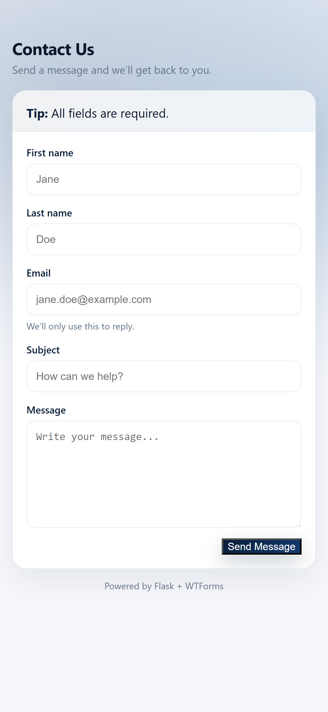

# Flask Contact Us Application (Secure Forms with Flask-WTF)

A production-structured **Contact Us web application** built with Flask, focused on **secure form handling, validation, and CSRF protection**.  
This project is designed to demonstrate how modern Flask applications handle user input safely and cleanly using industry-standard tools.

---

## Project Overview 

This project showcases my understanding of:

- Secure form handling in Flask
- CSRF (Cross-Site Request Forgery) protection
- Input validation and data integrity
- Clean project structure and separation of concerns
- Environment-based configuration
- Database persistence using an ORM

Although the application is simple in scope, it follows **real production patterns** commonly used in larger systems.

---

## Why This Project Exists

Forms are one of the most common **attack surfaces** in web applications.  
This project demonstrates how to properly:

- Accept user input
- Validate and sanitize data
- Protect against CSRF attacks
- Store submissions safely in a database

Rather than handling forms manually, this project uses **Flask-WTF**, which is the standard approach in professional Flask applications.

---

## Key Features

- Secure contact form (Name, Email, Message)
- Server-side validation using WTForms
- Email format validation using `email-validator`
- Built-in CSRF protection
- Database storage with SQLAlchemy
- Environment-based secrets using `.env`
- Clean, scalable project layout

---

## Technology Stack

- **Python**
- **Flask** – Web framework
- **Flask-WTF** – Secure form handling & CSRF protection
- **WTForms** – Form fields and validators
- **Flask-SQLAlchemy** – ORM and database abstraction
- **SQLite** – Development database
- **python-dotenv** – Environment variable management

---

## Understanding Flask-WTF and CSRF Protection

### What is Flask-WTF?

Flask-WTF is a Flask extension that integrates the WTForms library, making form creation and validation easier in Flask applications. It provides a structured way to build forms, handle validation, and render them in HTML.

- Declarative form definitions
- Server-side validation
- Automatic CSRF protection
- Secure handling of user input

Instead of manually parsing `request.form`, forms are defined as Python classes, making the code cleaner, safer, and easier to maintain.

---

### What is CSRF and Why It Matters?

**CSRF (Cross-Site Request Forgery)** is an attack where unauthorized requests are submitted from a user that the web application trusts.

Example risk:
- A bot or malicious site submits your form on behalf of a logged-in user.

---

### How Flask-WTF Protects Against CSRF

Flask-WTF automatically:

1. Generates a **unique CSRF token** per session
2. Embeds the token in every form
3. Validates the token on submission
4. Rejects requests without a valid token

This happens automatically once `SECRET_KEY` is configured.

```html
<form method="POST">
    {{ form.hidden_tag() }}
    ...
</form>
```

---

## Quickstart (Local Setup)

1. Create and activate a virtual environment

2. Install dependencies

    - `pip install -r requirements.txt`

3. Create a `.env` file (based on `.env.example`) with:

    - `SECRET_KEY` (any long random string)
    - `DATABASE_URL` (example: `sqlite:///instance/any-name.db`)

4. Apply migrations (creates the database tables)

    - `flask --app app db upgrade`

5. Run the app

    - `python app.py`

---

## Project Structure

contact_form/
│
├── app.py                 # Entry point (registers blueprints)
├── config.py              # App factory + extensions (SQLAlchemy, Migrate)
├── forms/
│   ├── __init__.py
│   └── forms.py           # Flask-WTF form definitions
├── models/
│   ├── __init__.py
│   └── models.py          # SQLAlchemy models
├── routes/
│   ├── __init__.py
│   └── routes.py          # Contact form routes
├── templates/
│   └── contact.html       # UI template
├── migrations/            # Alembic migrations (Flask-Migrate)
├── instance/              # SQLite database location (dev)
├── .env.example           # Environment variable template
├── requirements.txt
└── README.md

---

## Screenshots 
