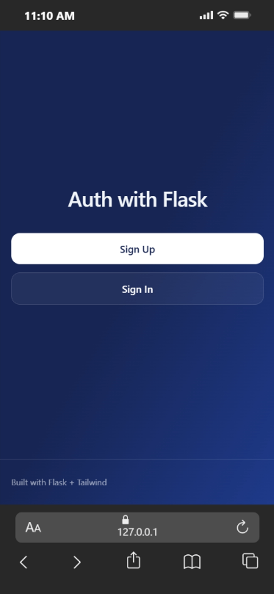
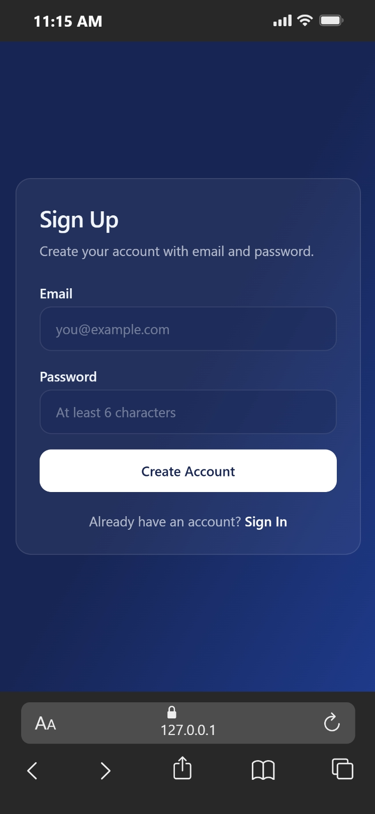
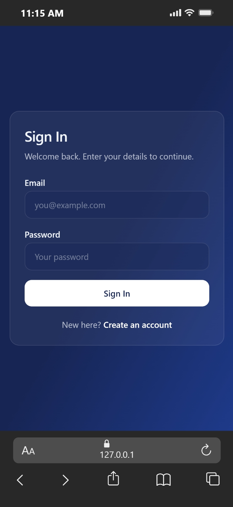
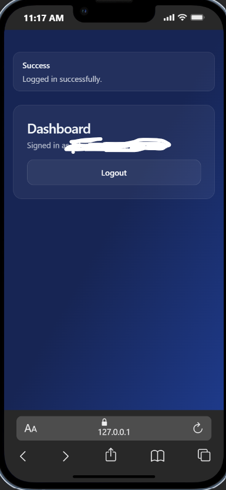

""" 
# Flask Sign In / Sign Out Application (Authentication with Flask-Login)

A production-structured **Sign In / Sign Out web application** built with Flask, focused on **secure authentication**, **session management**, and **database-backed user accounts**.

This project is designed to demonstrate how modern Flask applications implement login flows cleanly and safely using common tools like **Flask-Login**, **Flask-WTF**, and **SQLAlchemy**.

---

## Project Overview

This project showcases my understanding of:

- User authentication flows (sign up, sign in, sign out)
- Secure password handling (hashing + verification)
- Session management and protected routes
- Server-side validation with Flask-WTF / WTForms
- Clean project structure and separation of concerns (blueprints, models, forms)
- Environment-based configuration via `.env`
- Database persistence and migrations

Although the app is beginner-friendly in scope, it follows patterns used in real production Flask apps.

---

## Why This Project Exists

Authentication is one of the most common and most sensitive parts of web applications.

This project exists to demonstrate how to properly:

- Create user accounts and store them in a database
- Validate credentials securely
- Maintain login state across requests
- Protect pages that require authentication
- Support repeatable database changes using migrations

---

## Problem This Project Solves

It’s easy to build login features that “work” but are unsafe or fragile (plaintext passwords, inconsistent validation, broken sessions, unprotected routes).

This project solves that by implementing a structured, repeatable authentication workflow with:

- Password hashing (never storing plaintext passwords)
- Session-backed authentication using Flask-Login
- Form validation + CSRF protection using Flask-WTF
- A persistent database schema managed through Flask-Migrate

---

## Key Features

- User registration (sign up)
- User login (sign in)
- User logout (sign out)
- Password hashing and verification (Werkzeug)
- Login-protected dashboard route
- Form validation (email + minimum password length)
- Database persistence with SQLAlchemy
- Database migrations with Flask-Migrate
- Environment-based secrets using `.env`
- Test JSON endpoints under `/test` for quick API-style verification

---

## Technology Stack

- **Python**
- **Flask** – Web framework
- **Flask-Login** – Session management + `@login_required`
- **Flask-WTF / WTForms** – Form handling, validation, CSRF protection
- **Flask-SQLAlchemy** – ORM and database abstraction
- **Flask-Migrate (Alembic)** – Database migrations
- **SQLite** – Development database
- **python-dotenv** – Environment variable management

---

## Developer Implementation Notes

- **Blueprint-based routing**: auth routes live under a dedicated blueprint and are registered in `app.py`.
- **Password security**: user passwords are hashed with Werkzeug (`generate_password_hash`) and verified with `check_password_hash`.
- **Route protection**: `/dashboard` and `/logout` require an authenticated session.
- **CSRF protection**: enabled by default for HTML forms via Flask-WTF.
- **Postgres compatibility**: `DATABASE_URL` is normalized in `config.py` to support modern SQLAlchemy drivers.

---

## Screenshots






---

## Project Structure

```text
signin_signout/
│
├── app.py                 # App entry point (registers blueprints, login manager)
├── config.py              # App factory + extensions (SQLAlchemy, Migrate)
├── wsgi.py                # Production entry point (Gunicorn)
├── requirements.txt
├── forms/
│   └── forms.py           # SignUpForm / SignInForm (Flask-WTF)
├── models/
│   └── models.py          # User model + password hashing helpers
├── routes/
│   └── routes.py          # Web auth routes (signup/signin/logout/dashboard)
├── templates/             # Jinja templates
├── migrations/            # Alembic migrations (Flask-Migrate)
├── instance/              # Local-only runtime files (dev)
├── tests/
│   └── tests.py           # JSON test endpoints under /test
└── README.md
```

---

## Endpoints

### Web (HTML)

- `GET /` — Home page
- `GET,POST /signup` — Register a new user
- `GET,POST /signin` — Sign in
- `GET /dashboard` — Dashboard (login required)
- `GET /logout` — Log out (login required)

### Test API (JSON)

These routes are registered under the `/test` prefix.

- `GET /test/` — Health check
- `POST /test/signup` — Create account (JSON/form)
- `POST /test/signin` — Log in (JSON/form)
- `POST /test/logout` — Log out (login required)
- `GET /test/status/<user_id>` — Lookup a single user
- `GET /test/status` — List all users

---

## Quickstart (Windows)

### 1) Create and activate a virtual environment

```bash
py -m venv .venv
.venv\Scripts\activate
```

### 2) Install dependencies

```bash
pip install -r requirements.txt
```

### 3) Create a `.env` file

Create `.env` in the project root (you can copy `.env.example`):

```env
SECRET_KEY=change-me
DATABASE_URL=sqlite:///any-name.db
```

### 4) Apply migrations

```bash
flask --app app db upgrade
```

### 5) Run the app

```bash
flask --app app run
```

Open: http://127.0.0.1:5000/

"""


