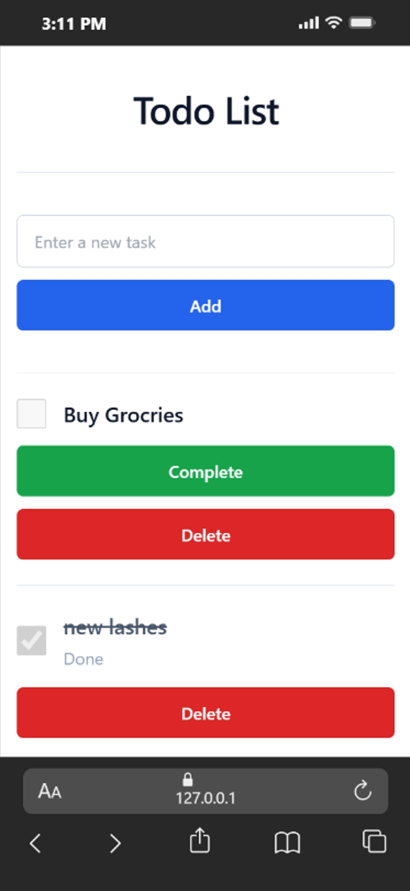

# Flask Todo List Application (Flask + SQLAlchemy + Tailwind)

A beginner-friendly **Todo List web application** built with Flask and SQLAlchemy, with a clean, responsive UI styled using **Tailwind CSS (CDN)**.

---

## Project Overview

This project showcases my understanding of:

- Flask blueprints + routing
- Server-rendered HTML with Jinja templates
- Form handling with Flask-WTF (CSRF protection)
- Database persistence with SQLAlchemy
- Database migrations with Flask-Migrate (Alembic)
- Environment-based configuration via `.env`
- Building a modern, responsive UI

---

## Key Features

- Add a new task
- Mark a task as complete
- Delete a task
- Responsive layout (mobile and desktop)
- JSON test endpoints for quick Postman testing

---

## Technology Stack

- **Python**
- **Flask**
- **Flask-WTF / WTForms**
- **Flask-SQLAlchemy**
- **Flask-Migrate (Alembic)**
- **SQLite** (development)
- **Tailwind CSS** (CDN)
- **python-dotenv**

---

## Screenshots



---

## Endpoints

### Web (HTML)

- `GET /` — Redirects to `/todos`
- `GET,POST /todos` — List tasks + add a new task
- `POST /todos/complete/<todo_id>` — Mark a task complete
- `POST /todos/delete/<todo_id>` — Delete a task

### Test API (JSON)

These routes are registered at the app root.

- `POST /` — Health check
- `POST /test` — Create todo (JSON/form)
- `GET /test/all` — List all todos
- `DELETE /test/clear/<test_id>` — Delete a single todo

---

## Quickstart (Windows)

### 1) Create and activate a virtual environment

```bash
py -m venv .venv
.venv\Scripts\activate
```

### 2) Install dependencies

```bash
pip install -r requirements.txt
```

### 3) Create a `.env` file

Create `.env` in the project root (you can copy `.env.example`):

```env
SECRET_KEY=change-me
DATABASE_URL=sqlite:///todo_list.db
```

### 4) Apply migrations

```bash
flask --app app db upgrade
```

### 5) Run the app

```bash
flask --app app run
```

Open: http://127.0.0.1:5000/todos
